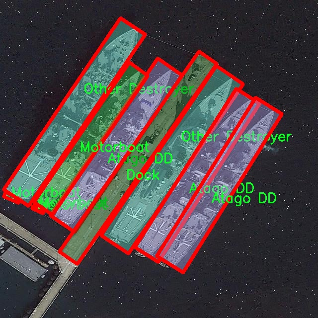

# 卫星航拍图船只识别分割系统源码＆数据集分享
 [yolov8-seg-C2f-ContextGuided＆yolov8-seg-C2f-RFCAConv等50+全套改进创新点发刊_一键训练教程_Web前端展示]

### 1.研究背景与意义

项目参考[ILSVRC ImageNet Large Scale Visual Recognition Challenge](https://gitee.com/YOLOv8_YOLOv11_Segmentation_Studio/projects)

项目来源[AAAI Global Al lnnovation Contest](https://kdocs.cn/l/cszuIiCKVNis)

研究背景与意义

随着全球航运业的快速发展，海洋交通的安全与效率日益受到重视。船只的种类繁多，从货船、油轮到军舰、游艇等，如何有效地识别和分割这些船只，成为了海洋监测、环境保护及海洋安全等领域的重要研究课题。传统的船只识别方法多依赖于人工监测，效率低下且容易受到人为因素的影响。近年来，随着深度学习技术的迅猛发展，基于计算机视觉的自动化识别系统逐渐成为解决这一问题的有效手段。

在众多计算机视觉模型中，YOLO（You Only Look Once）系列因其高效的实时检测能力而备受关注。YOLOv8作为该系列的最新版本，结合了更为先进的特征提取和处理机制，能够在复杂环境中实现高精度的目标检测与分割。然而，现有的YOLOv8模型在特定领域的应用，尤其是在卫星航拍图像的船只识别与分割方面，仍存在一定的局限性。针对这一问题，本文提出了一种基于改进YOLOv8的卫星航拍图船只识别分割系统，旨在提升船只识别的准确性和效率。

本研究所使用的数据集包含1600幅图像，涵盖49类不同类型的船只，包括军舰、货船、游艇等。这一丰富的类别信息为模型的训练提供了良好的基础，能够有效提升模型的泛化能力和识别精度。通过对数据集的深入分析，我们发现不同类型船只在外观、尺寸和形态上存在显著差异，这为模型的特征提取和分类提供了挑战。为此，我们将对YOLOv8进行针对性的改进，优化其在多类别船只识别中的表现。

此外，卫星航拍图像具有高分辨率和广覆盖的特点，能够为海洋监测提供全面的视角。然而，航拍图像中的船只往往受到光照、天气、海浪等因素的影响，导致识别的难度增加。因此，本研究还将探索图像预处理和数据增强技术，以提高模型在复杂环境下的鲁棒性。通过对YOLOv8模型的改进和优化，我们期望能够实现高效、准确的船只识别与分割，为海洋监测、海洋安全和环境保护提供强有力的技术支持。

综上所述，基于改进YOLOv8的卫星航拍图船只识别分割系统的研究，不仅具有重要的理论意义，还具备广泛的应用前景。随着海洋资源的日益枯竭和海洋环境问题的加剧，构建高效的船只识别与监测系统将为海洋治理提供科学依据和技术保障。通过本研究的深入开展，我们希望能够为未来的海洋监测和管理提供新的思路和方法，推动相关领域的技术进步与应用发展。

### 2.图片演示


##### 注意：由于此博客编辑较早，上面“2.图片演示”和“3.视频演示”展示的系统图片或者视频可能为老版本，新版本在老版本的基础上升级如下：（实际效果以升级的新版本为准）

  （1）适配了YOLOV8的“目标检测”模型和“实例分割”模型，通过加载相应的权重（.pt）文件即可自适应加载模型。

  （2）支持“图片识别”、“视频识别”、“摄像头实时识别”三种识别模式。

  （3）支持“图片识别”、“视频识别”、“摄像头实时识别”三种识别结果保存导出，解决手动导出（容易卡顿出现爆内存）存在的问题，识别完自动保存结果并导出到tempDir中。

  （4）支持Web前端系统中的标题、背景图等自定义修改，后面提供修改教程。

  另外本项目提供训练的数据集和训练教程,暂不提供权重文件（best.pt）,需要您按照教程进行训练后实现图片演示和Web前端界面演示的效果。

### 3.视频演示

[3.1 视频演示](https://www.bilibili.com/video/BV1vF2bYbEVp/)

### 4.数据集信息展示

##### 4.1 本项目数据集详细数据（类别数＆类别名）

nc: 49
names: ['AOE', 'Arleigh Burke DD', 'Asagiri DD', 'Atago DD', 'Austin LL', 'Barge', 'Cargo', 'Commander', 'Container Ship', 'Dock', 'EPF', 'Enterprise', 'Ferry', 'Hatsuyuki DD', 'Hovercraft', 'Hyuga DD', 'LHA LL', 'LSD 41 LL', 'Masyuu AS', 'Medical Ship', 'Midway', 'Motorboat', 'Nimitz', 'Oil Tanker', 'Osumi LL', 'Other Aircraft Carrier', 'Other Auxiliary Ship', 'Other Destroyer', 'Other Frigate', 'Other Landing', 'Other Merchant', 'Other Ship', 'Other Warship', 'Patrol', 'Perry FF', 'RoRo', 'Sailboat', 'Sanantonio AS', 'Submarine', 'Test Ship', 'Ticonderoga', 'Training Ship', 'Tugboat', 'Wasp LL', 'Yacht', 'YuDao LL', 'YuDeng LL', 'YuTing LL', 'YuZhao LL']


##### 4.2 本项目数据集信息介绍

数据集信息展示

在本研究中，我们采用了名为“Boat ID Segmentation”的数据集，以改进YOLOv8-seg的卫星航拍图船只识别分割系统。该数据集专门针对海洋和内陆水域中的船只进行标注，涵盖了多种类型的船只，具有丰富的多样性和复杂性，适合用于深度学习模型的训练和评估。数据集中包含49个类别的船只，涵盖了从军舰到民用船只的广泛范围，这使得模型在实际应用中能够具备更强的识别能力和适应性。

数据集中的类别包括各种类型的军舰，如“Arleigh Burke DD”、“Asagiri DD”、“Hyuga DD”、“Nimitz”等，这些都是现代海军舰艇的代表，具有独特的外形特征和功能。除此之外，数据集中还包含了如“Cargo”、“Container Ship”、“Oil Tanker”等民用船只，这些船只在全球贸易和运输中扮演着重要角色。还有“Ferry”、“Motorboat”、“Sailboat”等多种小型船只，展示了水上交通的多样性。

在具体的类别列表中，我们可以看到一些特殊用途的船只，例如“Medical Ship”和“Test Ship”，这些船只在特定场合下具有重要的功能和意义。此外，数据集中还包括了“Hovercraft”、“Submarine”等特殊设计的船只，进一步丰富了模型的训练数据。这种多样性不仅有助于提升模型的准确性，也为其在不同场景下的应用提供了广泛的可能性。

数据集的设计充分考虑了船只在不同环境和条件下的表现，使得模型能够在复杂的背景中准确识别目标。卫星航拍图像的使用，意味着数据集中的图像不仅具有高分辨率，还能够提供丰富的上下文信息，这对于提高船只识别的精度至关重要。通过对这些图像进行精确的标注，研究人员能够训练出更加智能的模型，从而在实际应用中实现高效的船只监测和识别。

在训练过程中，YOLOv8-seg模型将利用这些多样化的类别信息，学习到每种船只的特征和形态。模型的输出将不仅仅是船只的类别，还将提供精确的分割结果，帮助用户在复杂的海洋环境中快速识别和分类船只。这种技术的进步将对海洋监测、海上安全以及环境保护等领域产生深远的影响。

综上所述，“Boat ID Segmentation”数据集以其丰富的类别和高质量的图像，为改进YOLOv8-seg的船只识别分割系统提供了坚实的基础。通过充分利用这一数据集，我们期望能够在船只识别的准确性和效率上取得显著提升，为未来的海洋研究和应用提供更为强大的技术支持。





### 5.全套项目环境部署视频教程（零基础手把手教学）

[5.1 环境部署教程链接（零基础手把手教学）](https://www.bilibili.com/video/BV1jG4Ve4E9t/?vd_source=bc9aec86d164b67a7004b996143742dc)


[5.2 安装Python虚拟环境创建和依赖库安装视频教程链接（零基础手把手教学）](https://www.bilibili.com/video/BV1nA4VeYEze/?vd_source=bc9aec86d164b67a7004b996143742dc)

### 6.手把手YOLOV8-seg训练视频教程（零基础小白有手就能学会）

[6.1 手把手YOLOV8-seg训练视频教程（零基础小白有手就能学会）](https://www.bilibili.com/video/BV1cA4VeYETe/?vd_source=bc9aec86d164b67a7004b996143742dc)


按照上面的训练视频教程链接加载项目提供的数据集，运行train.py即可开始训练



     Epoch   gpu_mem       box       obj       cls    labels  img_size
     1/200     0G   0.01576   0.01955  0.007536        22      1280: 100%|██████████| 849/849 [14:42<00:00,  1.04s/it]
               Class     Images     Labels          P          R     mAP@.5 mAP@.5:.95: 100%|██████████| 213/213 [01:14<00:00,  2.87it/s]
                 all       3395      17314      0.994      0.957      0.0957      0.0843

     Epoch   gpu_mem       box       obj       cls    labels  img_size
     2/200     0G   0.01578   0.01923  0.007006        22      1280: 100%|██████████| 849/849 [14:44<00:00,  1.04s/it]
               Class     Images     Labels          P          R     mAP@.5 mAP@.5:.95: 100%|██████████| 213/213 [01:12<00:00,  2.95it/s]
                 all       3395      17314      0.996      0.956      0.0957      0.0845

     Epoch   gpu_mem       box       obj       cls    labels  img_size
     3/200     0G   0.01561    0.0191  0.006895        27      1280: 100%|██████████| 849/849 [10:56<00:00,  1.29it/s]
               Class     Images     Labels          P          R     mAP@.5 mAP@.5:.95: 100%|███████   | 187/213 [00:52<00:00,  4.04it/s]
                 all       3395      17314      0.996      0.957      0.0957      0.0845


### 7.50+种全套YOLOV8-seg创新点代码加载调参视频教程（一键加载写好的改进模型的配置文件）

[7.1 50+种全套YOLOV8-seg创新点代码加载调参视频教程（一键加载写好的改进模型的配置文件）](https://www.bilibili.com/video/BV1Hw4VePEXv/?vd_source=bc9aec86d164b67a7004b996143742dc)

### 8.YOLOV8-seg图像分割算法原理

原始YOLOv8-seg算法原理

YOLOv8-seg算法是YOLO系列模型的最新进展，推出于2023年1月10日，旨在实现更高效的目标检测与实例分割任务。该算法在设计上继承了YOLOv5的优点，同时结合了YOLOv6、YOLOX等模型的创新理念，形成了一种全新的结构，极大地提升了模型的性能和实用性。YOLOv8-seg的核心在于其改进的网络架构、数据处理方式以及损失函数的设计，使其在精度和执行速度上均优于现有的模型。

首先，YOLOv8-seg的骨干网络采用了全新的C2f模块，取代了YOLOv5中的C3模块。C2f模块通过引入更多的跳层连接和分支结构，增强了特征的传递和梯度的流动。这种设计不仅提高了特征提取的效率，还使得模型在面对复杂场景时能够更好地捕捉细节信息。此外，YOLOv8-seg的第一个卷积层的卷积核尺寸从6x6缩小至3x3，这一变化使得模型在处理高分辨率图像时，能够更精细地捕捉到图像中的细微特征。

在特征融合方面，YOLOv8-seg依然采用了FPN（特征金字塔网络）与PAN（路径聚合网络）的结合结构，以实现多尺度特征的有效融合。通过这种结构，模型能够在不同层次上获取丰富的上下文信息，从而提升对小目标的检测能力。尤其是在复杂的背景下，YOLOv8-seg能够更准确地分辨出目标与背景之间的差异，确保检测的准确性。

YOLOv8-seg的检测头部分经历了显著的变化。与之前的耦合头不同，YOLOv8-seg采用了解耦头结构，将分类和定位任务分开处理。这样的设计使得模型在进行目标检测时，能够更专注于每个任务的特征提取，进而提高了检测的精度。具体而言，解耦头通过两条并行的卷积分支，分别提取类别特征和位置特征，然后利用1x1卷积进行分类和定位的计算。这种方法不仅简化了模型的结构，还提高了其计算效率。

在损失函数的设计上，YOLOv8-seg引入了Varifocal Loss（VFL）和CIoU Loss与DFL Loss的组合，旨在更有效地处理正负样本的匹配问题。VFL通过不对称参数对正负样本进行加权，增强了高质量正样本对损失的贡献，同时降低了负样本对整体损失的影响。这一策略使得模型在训练过程中，能够更好地聚焦于那些具有代表性的样本，从而提升了模型的整体性能。

数据预处理方面，YOLOv8-seg依然沿用了YOLOv5的策略，采用了多种数据增强技术，如马赛克增强、混合增强、空间扰动和颜色扰动等。这些技术的引入不仅丰富了训练数据的多样性，还提高了模型的鲁棒性，使其在面对不同场景时，能够保持良好的检测性能。

值得一提的是，YOLOv8-seg在标签分配策略上进行了创新，采用了与YOLOv6相同的TOOD策略。这种动态标签分配策略能够有效解决传统候选框聚类方法在数据集不足时所带来的问题，确保了正负样本的合理匹配。通过这种方式，YOLOv8-seg能够在多尺度分配中实现更高的准确性，从而提升了整体的检测效果。

综上所述，YOLOv8-seg算法在多个方面进行了全面的改进与创新。其新的骨干网络结构、特征融合方法、解耦检测头以及先进的损失函数设计，使得该模型在目标检测与实例分割任务中表现出色。无论是在精度还是执行速度上，YOLOv8-seg都展现出了强大的能力，成为计算机视觉领域中一款不可或缺的工具。随着YOLOv8-seg的广泛应用，未来在智能监控、自动驾驶、无人机视觉等领域，必将发挥出更大的潜力。


### 9.系统功能展示（检测对象为举例，实际内容以本项目数据集为准）

图9.1.系统支持检测结果表格显示

  图9.2.系统支持置信度和IOU阈值手动调节

  图9.3.系统支持自定义加载权重文件best.pt(需要你通过步骤5中训练获得)

  图9.4.系统支持摄像头实时识别

  图9.5.系统支持图片识别

  图9.6.系统支持视频识别

  图9.7.系统支持识别结果文件自动保存

  图9.8.系统支持Excel导出检测结果数据


### 10.50+种全套YOLOV8-seg创新点原理讲解（非科班也可以轻松写刊发刊，V11版本正在科研待更新）

#### 10.1 由于篇幅限制，每个创新点的具体原理讲解就不一一展开，具体见下列网址中的创新点对应子项目的技术原理博客网址【Blog】：


[10.1 50+种全套YOLOV8-seg创新点原理讲解链接](https://gitee.com/qunmasj/good)

#### 10.2 部分改进模块原理讲解(完整的改进原理见上图和技术博客链接)【如果此小节的图加载失败可以通过CSDN或者Github搜索该博客的标题访问原始博客，原始博客图片显示正常】
### YOLOv8简介
YOLOv8目标检测算法继承了YOLOv1 系列的思考,是一种新型端到端的目标检测算法,尽管现在原始检测算法已经开源,但是鲜有发表的相关论文.YOLOv8的网络结构如图1[1所示,主要可分为Input输入端、Backbone 骨干神经网络、Neck混合特征网络层和 Head预测层网络共4个部分.

输入端( input)方法包含的功能模块有:马赛克( mosaic)数据增强、自适应锚框( anchor)计算、自适应图片缩放和 Mixup 数据增强['6].马赛克数据增强包括3种方式:缩放,色彩空间调整和马赛克增强.
该方法通过将4张图像进行随机的缩放﹑裁剪和打乱分布方式等操作来重新拼接图像,可丰富检测的数据集,具体步骤可见图2.随机缩放增加的许多小目标,非常适于解决卫星数据往往因距离目标过远从而导致图像中几乎都是小目标这一问题.在自适应锚框计算中, YOLO算法在每次训练数据之前,都会根据标注信息自动计算该数据集最合适的锚框尺寸,然后自动匹配最佳锚框.而自适应图片缩放只在检测时使用,由于不同场景需求不同,因而基于缩放系数YOLOv8提供了多尺度的不同大小模型.Mixup 数据增强鼓励模型对训练样本有一个线性的理解,具体做法是在目标检测中将两幅图像的像素值按照图像透明度的通道信息( alpha值)进行线性融合,对于标签box的处理直接采用拼接( con-cat)的方法拼接到一起.


Backbone骨干网络指用来提取图像特征的网络,整体结构包括注意力机制( focus)模块、跨阶段局部网络[ 7] ( cross stage partial network , CSP)和空间金字塔池化结构( spatial pyramid pooling,SPP).其中, Focus模块的作用是在图片进入 Backbone骨干网络前,对图片进行切片操作,即在一张图片中每隔一个像素取一个值,获得4张互补的图片,最后将新生成的图片经过卷积操作,得到没有信息丢失的2倍下采样特征图.YOLOv8使用了CSPNet 中的C2f网络,网络见图3,其中 CBS 就是卷积层,而瓶颈层( bottleneck layer)使用的是1* 1的卷积神经网络.C2f网络在保证轻量化的同时获得更加丰富的梯度流信息.而SPP结构是空间金字塔池化,能将任意大小的特征图转换成固定大小的特征向量,即把输入的特征地图划分为多个尺度,然后对每个图进行最大池化,再将提取的特征值拼接起来成为一维向量,输入SPP层获取分类.


Neck 结构如图4所示,它是由卷积层和C2f模块组成的的网络层,采用了路径聚合网络( path ag-gregation network ,PAN)和特征金字塔网络( featurepyramid networks , FPN)的结构对特征进行多尺度融合,目标是将图像特征传递到预测层.其中 PAN结构指图4左半边,它自底向上进行下采样,使顶层特征包含图像位置信息,两个特征最后进行融合,使不同尺寸的特征图都包含图像语义信息和图像特征信息，保证了网络对不同尺寸的图片的准确预测.而FPN结构指图4右半边,指通过自顶向下进行上采样,将高层特征与底层特征进行融合,从而同时利用低层特征的高分辨率和高层特征的丰富语义信息,并进行了多尺度特征的独立预测,对小物体的检测效果有明显的提升.从 FPN模块的基础上看,它增加了自底向上的特征金字塔结构,保留了更多的浅层位置特征,将整体特征提取能力进一步提升.


Head的结构如图5所示,在该结构中 YOLOv8采用了解耦检测头( decoupled-head )[ 18],因为分类和定位的关注点不同,分类更关注目标的纹理内容而定位更关注目标的边缘信息.因而解耦头结构考虑到分类和定位所关注的内容的不同,采用不同的分支来进行运算,提升了检测效果,相对应的回归头的通道数也改变了.


### MS-Block简介
实时目标检测，以YOLO系列为例，已在工业领域中找到重要应用，特别是在边缘设备（如无人机和机器人）中。与之前的目标检测器不同，实时目标检测器旨在在速度和准确性之间追求最佳平衡。为了实现这一目标，提出了大量的工作：从第一代DarkNet到CSPNet，再到最近的扩展ELAN，随着性能的快速增长，实时目标检测器的架构经历了巨大的变化。

尽管性能令人印象深刻，但在不同尺度上识别对象仍然是实时目标检测器面临的基本挑战。这促使作者设计了一个强大的编码器架构，用于学习具有表现力的多尺度特征表示。具体而言，作者从两个新的角度考虑为实时目标检测编码多尺度特征：

从局部视角出发，作者设计了一个具有简单而有效的分层特征融合策略的MS-Block。受到Res2Net的启发，作者在MS-Block中引入了多个分支来进行特征提取，但不同的是，作者使用了一个带有深度卷积的 Inverted Bottleneck Block块，以实现对大Kernel的高效利用。

从全局视角出发，作者提出随着网络加深逐渐增加卷积的Kernel-Size。作者在浅层使用小Kernel卷积来更高效地处理高分辨率特征。另一方面，在深层中，作者采用大Kernel卷积来捕捉广泛的信息。

基于以上设计原则，作者呈现了作者的实时目标检测器，称为YOLO-MS。为了评估作者的YOLO-MS的性能，作者在MS COCO数据集上进行了全面的实验。还提供了与其他最先进方法的定量比较，以展示作者方法的强大性能。如图1所示，YOLO-MS在计算性能平衡方面优于其他近期的实时目标检测器。


具体而言，YOLO-MS-XS在MS COCO上获得了43%+的AP得分，仅具有450万个可学习参数和8.7亿个FLOPs。YOLO-MS-S和YOLO-MS分别获得了46%+和51%+的AP，可学习参数分别为810万和2220万。此外，作者的工作还可以作为其他YOLO模型的即插即用模块。通常情况下，作者的方法可以将YOLOv8的AP从37%+显著提高到40%+，甚至还可以使用更少的参数和FLOPs。

CSP Block是一个基于阶段级梯度路径的网络，平衡了梯度组合和计算成本。它是广泛应用于YOLO系列的基本构建块。已经提出了几种变体，包括YOLOv4和YOLOv5中的原始版本，Scaled YOLOv4中的CSPVoVNet，YOLOv7中的ELAN，以及RTMDet中提出的大Kernel单元。作者在图2(a)和图2(b)中分别展示了原始CSP块和ELAN的结构。


上述实时检测器中被忽视的一个关键方面是如何在基本构建块中编码多尺度特征。其中一个强大的设计原则是Res2Net，它聚合了来自不同层次的特征以增强多尺度表示。然而，这一原则并没有充分探索大Kernel卷积的作用，而大Kernel卷积已经在基于CNN的视觉识别任务模型中证明有效。将大Kernel卷积纳入Res2Net的主要障碍在于它们引入的计算开销，因为构建块采用了标准卷积。在作者的方法中，作者提出用 Inverted Bottleneck Block替代标准的3 × 3卷积，以享受大Kernel卷积的好处。

#### MS-Block

基于前面的分析，参考该博客提出了一个带有分层特征融合策略的全新Block，称为MS-Block，以增强实时目标检测器在提取多尺度特征时的能力，同时保持快速的推理速度。

MS-Block的具体结构如图2(c)所示。假设是输入特征。通过1×1卷积的转换后，X的通道维度增加到n*C。然后，作者将X分割成n个不同的组，表示为，其中。为了降低计算成本，作者选择n为3。

注意，除了之外，每个其他组都经过一个 Inverted Bottleneck Block层，用表示，其中k表示Kernel-Size，以获得。的数学表示如下：


根据这个公式，作者不将 Inverted Bottleneck Block层连接到，使其作为跨阶段连接，并保留来自前面层的信息。最后，作者将所有分割连接在一起，并应用1×1卷积来在所有分割之间进行交互，每个分割都编码不同尺度的特征。当网络加深时，这个1×1卷积也用于调整通道数。

#### Heterogeneous Kernel Selection Protocol
除了构建块的设计外，作者还从宏观角度探讨了卷积的使用。之前的实时目标检测器在不同的编码器阶段采用了同质卷积（即具有相同Kernel-Size的卷积），但作者认为这不是提取多尺度语义信息的最佳选项。

在金字塔结构中，从检测器的浅阶段提取的高分辨率特征通常用于捕捉细粒度语义，将用于检测小目标。相反，来自网络较深阶段的低分辨率特征用于捕捉高级语义，将用于检测大目标。如果作者在所有阶段都采用统一的小Kernel卷积，深阶段的有效感受野（ERF）将受到限制，影响大目标的性能。在每个阶段中引入大Kernel卷积可以帮助解决这个问题。然而，具有大的ERF的大Kernel可以编码更广泛的区域，这增加了在小目标外部包含噪声信息的概率，并且降低了推理速度。

在这项工作中，作者建议在不同阶段中采用异构卷积，以帮助捕获更丰富的多尺度特征。具体来说，在编码器的第一个阶段中，作者采用最小Kernel卷积，而最大Kernel卷积位于最后一个阶段。随后，作者逐步增加中间阶段的Kernel-Size，使其与特征分辨率的增加保持一致。这种策略允许提取细粒度和粗粒度的语义信息，增强了编码器的多尺度特征表示能力。

正如图所示，作者将k的值分别分配给编码器中的浅阶段到深阶段，取值为3、5、7和9。作者将其称为异构Kernel选择（HKS）协议。


作者的HKS协议能够在深层中扩大感受野，而不会对浅层产生任何其他影响。第4节的图4支持了作者的分析。此外，HKS不仅有助于编码更丰富的多尺度特征，还确保了高效的推理。

如表1所示，将大Kernel卷积应用于高分辨率特征会产生较高的计算开销。然而，作者的HKS协议在低分辨率特征上采用大Kernel卷积，从而与仅使用大Kernel卷积相比，大大降低了计算成本。


在实践中，作者经验性地发现，采用HKS协议的YOLO-MS的推理速度几乎与仅使用深度可分离的3 × 3卷积相同。


如图所示，作者模型的Backbone由4个阶段组成，每个阶段后面跟随1个步长为2的3 × 3卷积进行下采样。在第3个阶段后，作者添加了1个SPP块，与RTMDet中一样。在作者的编码器上，作者使用PAFPN作为Neck来构建特征金字塔[31, 35]。它融合了从Backbone不同阶段提取的多尺度特征。Neck中使用的基本构建块也是作者的MS-Block，在其中使用3 × 3深度可分离卷积进行快速推理。

此外，为了在速度和准确性之间取得更好的平衡，作者将Backbone中多级特征的通道深度减半。作者提供了3个不同尺度的YOLO-MS变体，即YOLO-MS-XS、YOLO-MS-S和YOLO-MS。不同尺度的YOLO-MS的详细配置列在表2中。对于YOLO-MS的其他部分，作者将其保持与RTMDet相同。


### 11.项目核心源码讲解（再也不用担心看不懂代码逻辑）

#### 11.1 log.py

以下是经过简化和注释的核心代码部分，保留了最重要的功能，并对每个部分进行了详细的中文注释：

```python
import os
import time
import cv2
import pandas as pd
from PIL import Image

def save_chinese_image(file_path, image_array):
    """
    保存带有中文路径的图片文件

    参数：
    file_path (str): 图片的保存路径，应包含中文字符
    image_array (numpy.ndarray): 要保存的 OpenCV 图像（即 numpy 数组）
    """
    try:
        # 将 OpenCV 图片转换为 Pillow Image 对象
        image = Image.fromarray(cv2.cvtColor(image_array, cv2.COLOR_BGR2RGB))
        # 使用 Pillow 保存图片文件
        image.save(file_path)
        print(f"成功保存图像到: {file_path}")
    except Exception as e:
        print(f"保存图像失败: {str(e)}")

class LogTable:
    def __init__(self, csv_file_path=None):
        """
        初始化类实例。

        参数：
        csv_file_path (str): 保存初始数据的CSV文件路径。
        """
        self.csv_file_path = csv_file_path
        # 初始化数据存储
        self.data = pd.DataFrame(columns=['文件路径', '识别结果', '位置', '面积', '时间'])

        # 尝试从CSV文件加载数据
        if csv_file_path and os.path.exists(csv_file_path):
            self.data = pd.read_csv(csv_file_path, encoding='utf-8')

    def add_log_entry(self, file_path, recognition_result, position, confidence, time_spent):
        """
        向日志中添加一条新记录。

        参数：
        file_path (str): 文件路径
        recognition_result (str): 识别结果
        position (str): 位置
        confidence (float): 置信度
        time_spent (float): 用时（通常是秒或毫秒）

        返回：
        None
        """
        # 创建新的数据行
        new_entry = pd.DataFrame([[file_path, recognition_result, position, confidence, time_spent]],
                                 columns=['文件路径', '识别结果', '位置', '面积', '时间'])
        # 将新行添加到DataFrame中
        self.data = pd.concat([new_entry, self.data]).reset_index(drop=True)

    def save_to_csv(self):
        """
        将更新后的DataFrame保存到CSV文件。
        """
        self.data.to_csv(self.csv_file_path, index=False, encoding='utf-8', mode='a', header=False)

    def clear_data(self):
        """
        清空数据。
        """
        self.data = pd.DataFrame(columns=['文件路径', '识别结果', '位置', '面积', '时间'])

# 示例使用
if __name__ == "__main__":
    log_table = LogTable('log.csv')  # 创建日志表实例
    log_table.add_log_entry('image1.png', '识别成功', '位置A', 0.95, 1.2)  # 添加日志条目
    log_table.save_to_csv()  # 保存到CSV文件
```

### 代码说明：
1. **save_chinese_image**: 该函数用于保存带有中文路径的图像文件。它使用Pillow库将OpenCV图像转换为Pillow图像，然后保存到指定路径。

2. **LogTable类**: 该类用于管理日志记录，包括初始化、添加日志条目、保存到CSV文件和清空数据的功能。
   - `__init__`: 初始化时尝试从CSV文件加载数据。
   - `add_log_entry`: 添加新的日志条目到DataFrame中。
   - `save_to_csv`: 将DataFrame保存到CSV文件。
   - `clear_data`: 清空DataFrame中的数据。

3. **示例使用**: 在主程序中创建`LogTable`实例，添加日志条目并保存到CSV文件。

这个程序文件 `log.py` 是一个用于处理图像和记录识别结果的模块。它主要包含了图像保存、结果记录和日志管理的功能。程序中使用了多个库，包括 OpenCV、Pandas、Pillow 和 NumPy，来实现图像处理和数据管理。

首先，文件定义了一个函数 `save_chinese_image`，用于保存带有中文路径的图像。这个函数接收一个文件路径和一个图像数组作为参数，使用 Pillow 库将 OpenCV 图像转换为 Pillow 图像对象，然后保存到指定路径。如果保存成功，会打印成功信息；如果失败，则会捕获异常并打印错误信息。

接下来，定义了一个 `ResultLogger` 类，用于记录识别结果。这个类在初始化时创建了一个空的 Pandas DataFrame，包含“识别结果”、“位置”、“面积”和“时间”四个列。类中有一个 `concat_results` 方法，用于将检测结果、位置、置信度和时间信息添加到 DataFrame 中，并返回更新后的 DataFrame。

然后，定义了一个 `LogTable` 类，用于管理日志数据和图像。该类在初始化时可以接收一个 CSV 文件路径，如果该文件存在，则尝试加载数据；如果不存在，则创建一个空的 DataFrame。类中有多个方法，包括 `add_frames` 用于添加图像和检测信息，`clear_frames` 用于清空保存的图像和结果，`save_frames_file` 用于保存图像或视频，`add_log_entry` 用于向日志中添加新记录，`clear_data` 用于清空数据，`save_to_csv` 用于将数据保存到 CSV 文件，以及 `update_table` 用于更新显示的日志表格。

在 `save_frames_file` 方法中，如果保存的图像列表不为空，则根据图像数量决定是保存为单张图片还是视频。如果只有一张图像，则保存为 PNG 格式；如果有多张图像，则使用 OpenCV 的 `VideoWriter` 将图像序列保存为 AVI 格式。

此外，`add_log_entry` 方法用于向日志中添加一条新记录，创建一个新的数据行并将其添加到 DataFrame 中。`save_to_csv` 方法则将更新后的 DataFrame 保存到指定的 CSV 文件中。

总的来说，这个模块为图像处理和结果记录提供了一个结构化的方式，能够有效地管理图像数据和识别结果，适合用于需要记录和保存识别结果的应用场景。

#### 11.2 ultralytics\engine\__init__.py

当然可以！以下是代码的核心部分，并附上详细的中文注释：

```python
# Ultralytics YOLO 🚀, AGPL-3.0 license

# 导入必要的库
import torch  # 导入PyTorch库，用于深度学习
from models.experimental import attempt_load  # 从模型库中导入尝试加载模型的函数
from utils.datasets import LoadImages  # 导入加载图像的工具
from utils.general import check_img_size, non_max_suppression  # 导入图像大小检查和非极大值抑制的工具
from utils.torch_utils import select_device  # 导入选择设备的工具

# 选择设备（CPU或GPU）
device = select_device('')  # 根据系统配置选择可用的设备

# 加载YOLO模型
model = attempt_load('yolov5s.pt', map_location=device)  # 加载预训练的YOLOv5模型

# 检查输入图像的大小
img_size = check_img_size(640, s=model.stride.max())  # 确保输入图像大小符合模型要求

# 加载图像数据
dataset = LoadImages('data/images', img_size=img_size)  # 从指定路径加载图像数据

# 进行推理
for path, img, im0s, vid_cap in dataset:  # 遍历数据集中的每一张图像
    img = torch.from_numpy(img).to(device).float()  # 将图像转换为Tensor并移动到选定设备
    img /= 255.0  # 归一化图像数据到[0, 1]范围

    # 进行模型推理
    pred = model(img, augment=False)[0]  # 通过模型进行推理，获取预测结果

    # 应用非极大值抑制，过滤重复的检测框
    pred = non_max_suppression(pred, conf_thres=0.25, iou_thres=0.45)  # 进行NMS处理

    # 处理检测结果
    for det in pred:  # 遍历每个检测结果
        if len(det):  # 如果检测结果不为空
            # 处理每个检测框的坐标和置信度
            pass  # 这里可以添加处理检测结果的代码
```

### 注释说明：
1. **导入库**：代码开始部分导入了进行深度学习和图像处理所需的库。
2. **选择设备**：使用`select_device`函数选择可用的计算设备（CPU或GPU）。
3. **加载模型**：使用`attempt_load`函数加载预训练的YOLOv5模型。
4. **检查图像大小**：确保输入图像的大小符合模型的要求。
5. **加载图像数据**：从指定路径加载图像数据，以便进行推理。
6. **推理过程**：遍历数据集中的每一张图像，进行模型推理并应用非极大值抑制（NMS）来过滤重复的检测框。
7. **处理检测结果**：对检测结果进行处理，可以在此处添加自定义的代码来处理检测框的坐标和置信度。

以上是代码的核心部分及其详细注释。

这个程序文件的文件名是 `ultralytics\engine\__init__.py`，它是 Ultralytics YOLO 项目的一部分。Ultralytics YOLO 是一个基于 YOLO（You Only Look Once）目标检测算法的实现，广泛应用于计算机视觉领域。文件的开头包含了一行注释，指出了该项目使用的是 AGPL-3.0 许可证，这意味着用户可以自由使用、修改和分发该代码，但需要遵循相应的许可证条款。

`__init__.py` 文件通常用于将一个目录标识为一个 Python 包，并可以在其中初始化包的内容。虽然在你提供的代码片段中没有更多的实现细节，但通常这个文件可能会包含一些初始化代码，导入其他模块，或者定义包的公共接口。

在 Ultralytics YOLO 项目中，这个文件可能会涉及到模型的加载、训练、推理等功能的封装，方便用户在使用时调用。通过这个文件，用户可以更方便地使用整个引擎的功能，而不需要直接操作内部的模块。

总的来说，`ultralytics\engine\__init__.py` 文件是 Ultralytics YOLO 项目中的一个重要组成部分，负责包的初始化和功能的整合。

#### 11.3 ui.py

以下是代码中最核心的部分，并附上详细的中文注释：

```python
import sys
import subprocess

def run_script(script_path):
    """
    使用当前 Python 环境运行指定的脚本。

    Args:
        script_path (str): 要运行的脚本路径

    Returns:
        None
    """
    # 获取当前 Python 解释器的路径
    python_path = sys.executable

    # 构建运行命令，使用 streamlit 运行指定的脚本
    command = f'"{python_path}" -m streamlit run "{script_path}"'

    # 执行命令
    result = subprocess.run(command, shell=True)
    # 检查命令执行的返回码，如果不为0则表示出错
    if result.returncode != 0:
        print("脚本运行出错。")

# 实例化并运行应用
if __name__ == "__main__":
    # 指定要运行的脚本路径
    script_path = "web.py"  # 这里可以直接指定脚本名，假设在当前目录下

    # 调用函数运行脚本
    run_script(script_path)
```

### 代码注释说明：
1. **导入模块**：
   - `sys`：用于访问与 Python 解释器紧密相关的变量和函数。
   - `subprocess`：用于执行外部命令和程序。

2. **定义 `run_script` 函数**：
   - 此函数接收一个脚本路径作为参数，并使用当前 Python 环境来运行该脚本。

3. **获取 Python 解释器路径**：
   - `sys.executable` 返回当前 Python 解释器的路径，以确保使用正确的 Python 环境。

4. **构建命令**：
   - 使用 f-string 格式化字符串，构建一个命令来运行 `streamlit`，并指定要执行的脚本。

5. **执行命令**：
   - `subprocess.run` 方法用于执行构建的命令，`shell=True` 允许在 shell 中执行命令。

6. **检查返回码**：
   - 如果命令执行后返回码不为 0，表示执行过程中出现错误，打印出错信息。

7. **主程序块**：
   - `if __name__ == "__main__":` 确保只有在直接运行该脚本时才会执行以下代码。
   - 指定要运行的脚本路径，并调用 `run_script` 函数执行该脚本。

这个程序文件名为 `ui.py`，主要功能是通过当前的 Python 环境运行一个指定的脚本。程序的第一部分导入了必要的模块，包括 `sys`、`os` 和 `subprocess`，以及一个自定义模块 `QtFusion.path` 中的 `abs_path` 函数。

在 `run_script` 函数中，首先定义了一个参数 `script_path`，用于接收要运行的脚本的路径。函数内部首先获取当前 Python 解释器的路径，接着构建一个命令字符串，该命令用于通过 `streamlit` 运行指定的脚本。命令的格式是 `"{python_path}" -m streamlit run "{script_path}"`，其中 `python_path` 是当前 Python 解释器的路径，`script_path` 是要运行的脚本路径。

然后，使用 `subprocess.run` 方法执行构建好的命令。这个方法会在新的 shell 中运行命令，并返回一个结果对象。通过检查 `result.returncode`，可以判断脚本是否成功运行。如果返回码不为 0，说明脚本运行出错，程序会输出相应的错误信息。

在文件的最后部分，使用 `if __name__ == "__main__":` 语句来确保只有在直接运行该文件时才会执行后面的代码。在这里，首先调用 `abs_path` 函数来获取 `web.py` 脚本的绝对路径，并将其赋值给 `script_path` 变量。最后，调用 `run_script` 函数，传入 `script_path`，以运行指定的脚本。

整体来看，这个程序的目的是为了方便地运行一个名为 `web.py` 的脚本，利用当前的 Python 环境和 `streamlit` 库。

#### 11.4 ui_style.py

以下是提取后的核心代码部分，并附上详细的中文注释：

```python
import base64
import streamlit as st

# 读取二进制文件并转换为 Base64 编码
def get_base64_of_bin_file(bin_file):
    # 以二进制模式打开文件
    with open(bin_file, 'rb') as file:
        # 读取文件内容
        data = file.read()
    # 将读取的二进制数据进行 Base64 编码，并解码为字符串返回
    return base64.b64encode(data).decode()

# 定义 CSS 样式
def def_css_hitml():
    st.markdown("""
        <style>
        /* 全局样式 */
        .css-2trqyj, .css-1d391kg, .st-bb, .st-at {
            font-family: 'Gill Sans', 'Gill Sans MT', Calibri, 'Trebuchet MS', sans-serif; /* 设置字体 */
            background-color: #cadefc; /* 设置背景颜色 */
            color: #21618C; /* 设置字体颜色 */
        }

        /* 按钮样式 */
        .stButton > button {
            border: none; /* 去掉边框 */
            color: white; /* 字体颜色为白色 */
            padding: 10px 20px; /* 设置内边距 */
            text-align: center; /* 文本居中 */
            display: inline-block; /* 使按钮成为行内块元素 */
            font-size: 16px; /* 设置字体大小 */
            margin: 2px 1px; /* 设置外边距 */
            cursor: pointer; /* 鼠标悬停时显示为手型 */
            border-radius: 8px; /* 设置圆角 */
            background-color: #9896f1; /* 设置背景颜色 */
            box-shadow: 0 2px 4px 0 rgba(0,0,0,0.2); /* 设置阴影效果 */
            transition-duration: 0.4s; /* 设置过渡效果的持续时间 */
        }
        .stButton > button:hover {
            background-color: #5499C7; /* 鼠标悬停时改变背景颜色 */
            color: white; /* 字体颜色保持为白色 */
            box-shadow: 0 8px 12px 0 rgba(0,0,0,0.24); /* 鼠标悬停时改变阴影效果 */
        }

        /* 侧边栏样式 */
        .css-1lcbmhc.e1fqkh3o0 {
            background-color: #154360; /* 设置侧边栏背景颜色 */
            color: #FDFEFE; /* 设置侧边栏字体颜色 */
            border-right: 2px solid #DDD; /* 设置右边框 */
        }

        /* Radio 按钮样式 */
        .stRadio > label {
            display: inline-flex; /* 使用弹性布局 */
            align-items: center; /* 垂直居中对齐 */
            cursor: pointer; /* 鼠标悬停时显示为手型 */
        }
        .stRadio > label > span:first-child {
            background-color: #FFF; /* 设置单选按钮背景颜色 */
            border: 1px solid #CCC; /* 设置边框 */
            width: 1em; /* 设置宽度 */
            height: 1em; /* 设置高度 */
            border-radius: 50%; /* 设置圆形 */
            margin-right: 10px; /* 设置右边距 */
            display: inline-block; /* 使其成为行内块元素 */
        }

        /* 滑块样式 */
        .stSlider .thumb {
            background-color: #2E86C1; /* 设置滑块的颜色 */
        }
        .stSlider .track {
            background-color: #DDD; /* 设置滑块轨道的颜色 */
        }

        /* 表格样式 */
        table {
            border-collapse: collapse; /* 合并边框 */
            margin: 25px 0; /* 设置外边距 */
            font-size: 18px; /* 设置字体大小 */
            font-family: sans-serif; /* 设置字体 */
            min-width: 400px; /* 设置最小宽度 */
            box-shadow: 0 5px 15px rgba(0, 0, 0, 0.2); /* 设置阴影效果 */
        }
        thead tr {
            background-color: #a8d8ea; /* 设置表头背景颜色 */
            color: #ffcef3; /* 设置表头字体颜色 */
            text-align: left; /* 设置文本左对齐 */
        }
        th, td {
            padding: 15px 18px; /* 设置单元格内边距 */
        }
        tbody tr {
            border-bottom: 2px solid #ddd; /* 设置行底部边框 */
        }
        tbody tr:nth-of-type(even) {
            background-color: #D6EAF8; /* 设置偶数行背景颜色 */
        }
        tbody tr:last-of-type {
            border-bottom: 3px solid #5499C7; /* 设置最后一行底部边框 */
        }
        tbody tr:hover {
            background-color: #AED6F1; /* 鼠标悬停时改变行背景颜色 */
        }
        </style>
        """, unsafe_allow_html=True)  # 允许使用 HTML
```

### 代码说明：
1. **导入库**：导入 `base64` 用于编码，导入 `streamlit` 用于构建网页应用。
2. **get_base64_of_bin_file 函数**：该函数接收一个二进制文件路径，读取文件内容并将其转换为 Base64 编码字符串。
3. **def_css_hitml 函数**：该函数定义了一系列 CSS 样式，用于美化 Streamlit 应用的界面，包括全局样式、按钮样式、侧边栏样式、单选按钮样式、滑块样式和表格样式。通过 `st.markdown` 方法将 CSS 样式应用到 Streamlit 应用中。

这个程序文件 `ui_style.py` 是一个用于 Streamlit 应用的样式定义文件。它主要包含了对应用界面元素的样式设置，旨在提升用户体验和视觉效果。

首先，文件导入了 `base64` 和 `streamlit` 库。`base64` 用于处理二进制文件的编码，而 `streamlit` 是一个用于构建数据应用的库。

接下来，定义了一个函数 `get_base64_of_bin_file(bin_file)`，该函数接收一个二进制文件的路径作为参数，打开该文件并读取其内容，然后将其转换为 Base64 编码格式并返回。这种处理通常用于在网页中嵌入图片或其他二进制数据。

然后，定义了 `def_css_hitml()` 函数，该函数使用 `st.markdown()` 方法将一段 CSS 样式嵌入到 Streamlit 应用中。这里的 CSS 样式定义了多个界面元素的外观，包括全局样式、按钮样式、侧边栏样式、单选按钮样式、滑块样式以及表格样式等。

在全局样式部分，设置了字体和背景颜色，使整个应用看起来更加统一和美观。按钮样式部分则定义了按钮的外观，包括边框、颜色、圆角、阴影效果和悬停时的变化效果，使按钮在用户交互时更具吸引力。

侧边栏的样式设置了背景颜色和文本颜色，确保其在视觉上与主内容区分开来。单选按钮和滑块的样式也进行了定制，以提升用户的操作体验。

最后，表格的样式部分则定义了表格的边框、间距、字体、背景颜色等，使得数据呈现更加清晰易读，尤其是对行的悬停效果和奇偶行的不同背景色设置，进一步增强了可读性。

总体而言，这个文件通过定义详细的 CSS 样式，旨在为 Streamlit 应用提供一个美观、友好的用户界面。

#### 11.5 ultralytics\models\fastsam\__init__.py

以下是保留的核心代码部分，并附上详细的中文注释：

```python
# 导入所需的模块和类
from .model import FastSAM  # 导入FastSAM模型类
from .predict import FastSAMPredictor  # 导入FastSAMPredictor类，用于进行预测
from .prompt import FastSAMPrompt  # 导入FastSAMPrompt类，用于处理提示
from .val import FastSAMValidator  # 导入FastSAMValidator类，用于验证模型性能

# 定义模块的公开接口，指定可以被外部访问的类
__all__ = 'FastSAMPredictor', 'FastSAM', 'FastSAMPrompt', 'FastSAMValidator'
```

### 代码注释说明：
1. **导入模块**：
   - 代码从当前包中导入了四个核心类，分别用于模型定义、预测、提示处理和验证。这些类是实现YOLO（You Only Look Once）目标检测算法的关键组成部分。

2. **`__all__`变量**：
   - `__all__`是一个特殊变量，用于定义当使用`from module import *`时，哪些名称是可以被导入的。这有助于控制模块的公共接口，避免不必要的名称暴露给外部使用者。

这个程序文件是一个Python模块的初始化文件，位于`ultralytics/models/fastsam`目录下。文件的主要功能是导入该模块中的几个重要类，并定义了一个`__all__`变量，以便于控制模块的公共接口。

首先，文件顶部的注释部分提到这是Ultralytics YOLO项目的一部分，并声明了使用AGPL-3.0许可证。这意味着该代码是开源的，并且用户在使用和分发时需要遵循该许可证的条款。

接下来，文件通过相对导入的方式引入了四个类：`FastSAM`、`FastSAMPredictor`、`FastSAMPrompt`和`FastSAMValidator`。这些类分别位于该模块的不同文件中，具体来说：

- `FastSAM`：可能是模型的核心类，负责定义和实现FastSAM算法的主要功能。
- `FastSAMPredictor`：这个类可能用于处理预测相关的任务，比如对输入数据进行推理。
- `FastSAMPrompt`：这个类可能涉及到与用户交互的功能，比如接收用户的输入或提示。
- `FastSAMValidator`：这个类可能用于验证模型的性能，评估其在特定数据集上的表现。

最后，`__all__`变量定义了模块的公共接口，包含了四个类的名称。这意味着当用户使用`from ultralytics.models.fastsam import *`这样的语句时，只会导入`FastSAMPredictor`、`FastSAM`、`FastSAMPrompt`和`FastSAMValidator`这四个类，而不会导入模块中的其他内容。这种做法有助于避免命名冲突，并使得模块的使用更加清晰和简洁。

#### 11.6 train.py

以下是代码中最核心的部分，并附上详细的中文注释：

```python
import os
import torch
import yaml
from ultralytics import YOLO  # 导入YOLO模型库

if __name__ == '__main__':  # 确保该模块被直接运行时才执行以下代码
    # 设置训练参数
    workers = 1  # 数据加载的工作进程数
    batch = 8  # 每个批次的样本数量，视显存情况调整
    device = "0" if torch.cuda.is_available() else "cpu"  # 检查是否有可用的GPU

    # 获取数据集配置文件的绝对路径
    data_path = abs_path(f'datasets/data/data.yaml', path_type='current')

    # 将路径转换为Unix风格
    unix_style_path = data_path.replace(os.sep, '/')
    # 获取数据集目录路径
    directory_path = os.path.dirname(unix_style_path)

    # 读取YAML配置文件
    with open(data_path, 'r') as file:
        data = yaml.load(file, Loader=yaml.FullLoader)

    # 修改数据集路径
    if 'train' in data and 'val' in data and 'test' in data:
        data['train'] = directory_path + '/train'  # 设置训练集路径
        data['val'] = directory_path + '/val'      # 设置验证集路径
        data['test'] = directory_path + '/test'    # 设置测试集路径

        # 将修改后的数据写回YAML文件
        with open(data_path, 'w') as file:
            yaml.safe_dump(data, file, sort_keys=False)

    # 加载YOLO模型
    model = YOLO(r"C:\codeseg\codenew\50+种YOLOv8算法改进源码大全和调试加载训练教程（非必要）\改进YOLOv8模型配置文件\yolov8-seg-C2f-Faster.yaml").load("./weights/yolov8s-seg.pt")

    # 开始训练模型
    results = model.train(
        data=data_path,  # 指定训练数据的配置文件路径
        device=device,  # 指定使用的设备（GPU或CPU）
        workers=workers,  # 数据加载的工作进程数
        imgsz=640,  # 输入图像的大小
        epochs=100,  # 训练的轮数
        batch=batch,  # 每个批次的样本数量
    )
```

### 代码注释说明：
1. **导入必要的库**：导入了操作系统、PyTorch、YAML处理库和YOLO模型库。
2. **主程序入口**：使用`if __name__ == '__main__':`确保代码块仅在直接运行时执行。
3. **设置训练参数**：定义了数据加载的工作进程数、批次大小和设备类型（GPU或CPU）。
4. **获取数据集配置文件路径**：使用`abs_path`函数获取数据集的YAML配置文件的绝对路径。
5. **读取和修改YAML文件**：读取YAML文件，修改训练、验证和测试集的路径，并将修改后的内容写回文件。
6. **加载YOLO模型**：根据指定的配置文件和权重文件加载YOLO模型。
7. **开始训练模型**：调用`model.train`方法开始训练，传入数据路径、设备、工作进程数、图像大小、训练轮数和批次大小等参数。

这个程序文件 `train.py` 是用于训练 YOLO（You Only Look Once）模型的脚本，主要功能是设置训练参数、加载数据集和模型，并启动训练过程。

首先，程序导入了必要的库，包括 `os`、`torch`、`yaml` 和 `ultralytics` 中的 YOLO 模型。`matplotlib` 被导入并设置为使用 `TkAgg` 后端，这通常用于图形界面的绘图。

在 `if __name__ == '__main__':` 语句下，程序确保只有在直接运行该脚本时才会执行以下代码。首先，设置了一些训练参数，包括工作进程数 `workers`、批次大小 `batch` 和设备 `device`。设备的选择是通过检查是否有可用的 GPU（使用 `torch.cuda.is_available()`）来决定的，如果有则使用 GPU（标记为 "0"），否则使用 CPU。

接下来，程序通过 `abs_path` 函数获取数据集配置文件 `data.yaml` 的绝对路径，并将路径中的分隔符统一为 Unix 风格。然后，程序提取该路径的目录部分。

程序打开 `data.yaml` 文件并读取其内容，使用 `yaml.load` 方法保持原有顺序。接着，程序检查 YAML 文件中是否包含 `train`、`val` 和 `test` 三个字段，如果存在，则将它们的路径修改为相对于目录的路径。修改后的数据会被写回到原 YAML 文件中，确保路径的正确性。

在模型加载部分，程序使用 YOLO 模型的配置文件 `yolov8-seg-C2f-Faster.yaml`，并加载预训练的权重文件 `yolov8s-seg.pt`。需要注意的是，不同的模型可能对设备的要求不同，因此如果遇到显存不足的错误，可以尝试使用其他模型配置文件。

最后，程序调用 `model.train` 方法开始训练模型，传入的数据配置文件路径、设备、工作进程数、输入图像大小（640x640）、训练的轮数（100个epoch）和批次大小（8）。这部分代码将启动训练过程，模型会根据指定的参数进行学习和优化。

总体来说，这个脚本是一个完整的训练流程，从数据准备到模型训练，适合用于 YOLO 模型的训练任务。

### 12.系统整体结构（节选）

### 整体功能和构架概括

该项目是一个基于 Ultralytics YOLO 的计算机视觉框架，主要用于目标检测和图像处理。项目的结构清晰，模块化设计使得各个功能模块相对独立，便于维护和扩展。主要功能包括数据处理、模型训练、推理、结果记录和用户界面等。通过不同的模块，用户可以方便地进行模型训练、结果可视化以及与模型交互。

以下是各个文件的功能整理表：

| 文件路径                                      | 功能描述                                                       |
|-------------------------------------------|------------------------------------------------------------|
| `C:\codeseg\codenew\code\log.py`         | 处理图像保存和结果记录，提供日志管理功能。                           |
| `C:\codeseg\codenew\code\ultralytics\engine\__init__.py` | 初始化 Ultralytics YOLO 引擎，导入核心模型类。                     |
| `C:\codeseg\codenew\code\ui.py`          | 运行指定的 Streamlit 脚本，提供用户界面交互功能。                     |
| `C:\codeseg\codenew\code\ui_style.py`    | 定义 Streamlit 应用的 CSS 样式，提升用户界面的美观性和可用性。          |
| `C:\codeseg\codenew\code\ultralytics\models\fastsam\__init__.py` | 初始化 FastSAM 模型模块，导入相关类以供使用。                      |
| `C:\codeseg\codenew\code\train.py`       | 训练 YOLO 模型，设置训练参数，加载数据集和模型，启动训练过程。          |
| `C:\codeseg\codenew\code\ultralytics\nn\backbone\fasternet.py` | 定义 FastNet 模型的网络结构，作为目标检测的主干网络。                 |
| `C:\codeseg\codenew\code\ultralytics\utils\dist.py` | 实现分布式训练相关的功能，处理多 GPU 训练的通信和同步。                 |
| `C:\codeseg\codenew\code\ultralytics\data\annotator.py` | 提供数据注释和可视化功能，帮助用户查看数据集和标注信息。                |
| `C:\codeseg\codenew\code\utils.py`       | 定义一些通用的工具函数，供其他模块调用。                               |
| `C:\codeseg\codenew\code\ultralytics\nn\extra_modules\dynamic_snake_conv.py` | 实现动态蛇形卷积，作为网络中的一个特殊模块。                          |
| `C:\codeseg\codenew\code\ultralytics\nn\extra_modules\ops_dcnv3\modules\__init__.py` | 初始化 DCNv3 模块，提供动态卷积的实现。                              |
| `C:\codeseg\codenew\code\ultralytics\utils\benchmarks.py` | 提供性能基准测试功能，评估模型的推理速度和效率。                       |

这个表格总结了每个文件的主要功能，帮助理解整个项目的结构和各个模块之间的关系。

注意：由于此博客编辑较早，上面“11.项目核心源码讲解（再也不用担心看不懂代码逻辑）”中部分代码可能会优化升级，仅供参考学习，完整“训练源码”、“Web前端界面”和“50+种创新点源码”以“14.完整训练+Web前端界面+50+种创新点源码、数据集获取”的内容为准。

### 13.图片、视频、摄像头图像分割Demo(去除WebUI)代码

在这个博客小节中，我们将讨论如何在不使用WebUI的情况下，实现图像分割模型的使用。本项目代码已经优化整合，方便用户将分割功能嵌入自己的项目中。
核心功能包括图片、视频、摄像头图像的分割，ROI区域的轮廓提取、类别分类、周长计算、面积计算、圆度计算以及颜色提取等。
这些功能提供了良好的二次开发基础。

### 核心代码解读

以下是主要代码片段，我们会为每一块代码进行详细的批注解释：

```python
import random
import cv2
import numpy as np
from PIL import ImageFont, ImageDraw, Image
from hashlib import md5
from model import Web_Detector
from chinese_name_list import Label_list

# 根据名称生成颜色
def generate_color_based_on_name(name):
    ......

# 计算多边形面积
def calculate_polygon_area(points):
    return cv2.contourArea(points.astype(np.float32))

...
# 绘制中文标签
def draw_with_chinese(image, text, position, font_size=20, color=(255, 0, 0)):
    image_pil = Image.fromarray(cv2.cvtColor(image, cv2.COLOR_BGR2RGB))
    draw = ImageDraw.Draw(image_pil)
    font = ImageFont.truetype("simsun.ttc", font_size, encoding="unic")
    draw.text(position, text, font=font, fill=color)
    return cv2.cvtColor(np.array(image_pil), cv2.COLOR_RGB2BGR)

# 动态调整参数
def adjust_parameter(image_size, base_size=1000):
    max_size = max(image_size)
    return max_size / base_size

# 绘制检测结果
def draw_detections(image, info, alpha=0.2):
    name, bbox, conf, cls_id, mask = info['class_name'], info['bbox'], info['score'], info['class_id'], info['mask']
    adjust_param = adjust_parameter(image.shape[:2])
    spacing = int(20 * adjust_param)

    if mask is None:
        x1, y1, x2, y2 = bbox
        aim_frame_area = (x2 - x1) * (y2 - y1)
        cv2.rectangle(image, (x1, y1), (x2, y2), color=(0, 0, 255), thickness=int(3 * adjust_param))
        image = draw_with_chinese(image, name, (x1, y1 - int(30 * adjust_param)), font_size=int(35 * adjust_param))
        y_offset = int(50 * adjust_param)  # 类别名称上方绘制，其下方留出空间
    else:
        mask_points = np.concatenate(mask)
        aim_frame_area = calculate_polygon_area(mask_points)
        mask_color = generate_color_based_on_name(name)
        try:
            overlay = image.copy()
            cv2.fillPoly(overlay, [mask_points.astype(np.int32)], mask_color)
            image = cv2.addWeighted(overlay, 0.3, image, 0.7, 0)
            cv2.drawContours(image, [mask_points.astype(np.int32)], -1, (0, 0, 255), thickness=int(8 * adjust_param))

            # 计算面积、周长、圆度
            area = cv2.contourArea(mask_points.astype(np.int32))
            perimeter = cv2.arcLength(mask_points.astype(np.int32), True)
            ......

            # 计算色彩
            mask = np.zeros(image.shape[:2], dtype=np.uint8)
            cv2.drawContours(mask, [mask_points.astype(np.int32)], -1, 255, -1)
            color_points = cv2.findNonZero(mask)
            ......

            # 绘制类别名称
            x, y = np.min(mask_points, axis=0).astype(int)
            image = draw_with_chinese(image, name, (x, y - int(30 * adjust_param)), font_size=int(35 * adjust_param))
            y_offset = int(50 * adjust_param)

            # 绘制面积、周长、圆度和色彩值
            metrics = [("Area", area), ("Perimeter", perimeter), ("Circularity", circularity), ("Color", color_str)]
            for idx, (metric_name, metric_value) in enumerate(metrics):
                ......

    return image, aim_frame_area

# 处理每帧图像
def process_frame(model, image):
    pre_img = model.preprocess(image)
    pred = model.predict(pre_img)
    det = pred[0] if det is not None and len(det)
    if det:
        det_info = model.postprocess(pred)
        for info in det_info:
            image, _ = draw_detections(image, info)
    return image

if __name__ == "__main__":
    cls_name = Label_list
    model = Web_Detector()
    model.load_model("./weights/yolov8s-seg.pt")

    # 摄像头实时处理
    cap = cv2.VideoCapture(0)
    while cap.isOpened():
        ret, frame = cap.read()
        if not ret:
            break
        ......

    # 图片处理
    image_path = './icon/OIP.jpg'
    image = cv2.imread(image_path)
    if image is not None:
        processed_image = process_frame(model, image)
        ......

    # 视频处理
    video_path = ''  # 输入视频的路径
    cap = cv2.VideoCapture(video_path)
    while cap.isOpened():
        ret, frame = cap.read()
        ......
```


### 14.完整训练+Web前端界面+50+种创新点源码、数据集获取


# [下载链接：https://mbd.pub/o/bread/Zpybk5pt](https://mbd.pub/o/bread/Zpybk5pt)